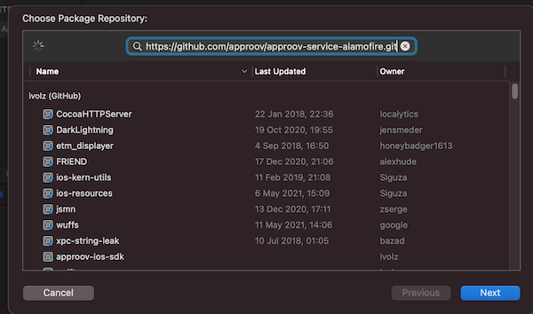

# Approov Service for Alamofire 

A wrapper for the [Approov SDK](https://github.com/approov/approov-ios-sdk) to enable easy integration when using [`Alamofire`](https://github.com/Alamofire/Alamofire) for making the API calls that you wish to protect with Approov. In order to use this you will need a trial or paid [Approov](https://www.approov.io) account.

## Adding ApproovService Dependency
The Approov integration is available via [`swift package manager`](https://developer.apple.com/documentation/swift_packages/adding_package_dependencies_to_your_app). This allows inclusion into the project by simply specifying a dependency in the `Add Package Dependency` Xcode option:




This package is actually an open source wrapper layer that allows you to easily use Approov with `Alamofire`. This has a further dependency to the closed source [Approov SDK](https://github.com/approov/approov-ios-sdk).

## Using the approov service Alamofire
The `ApproovSession` class extends the [Session](https://alamofire.github.io/Alamofire/Classes/Session.html) class defined by Alamofire and handles connections by providing pinning and including an additional ApproovSDK attestation call. The simplest way to use the `ApproovSession` class is to find and replace all the `Session` instances with `ApproovSession`. Additionaly, the Approov SDK needs to be initialized before use. As mentioned above, you will need a paid or trial account for [Approov](https://www.approov.io). Using the command line tools:

```
$ approov sdk -getConfig approov-initial.config
```

The `approov-initial.config` file must then be included in you application bundle and automatically loaded by the Approov SDK. 

## Approov Token Header
The default header name of `Approov-Token` can be changed by setting the variable `ApproovSession.approovTokenHeaderAndPrefix` like so:

```swift
ApproovSession.approovTokenHeaderAndPrefix = (approovTokenHeader: "Authorization", approovTokenPrefix: "Bearer ")
```

This will result in the Approov JWT token being appended to the `Bearer ` value of the `Authorization` header allowing your back end solution to reuse any code relying in `Authorization` header.
Please note that the default values for `approovTokenHeader` is `Approov-Token` and the `approovTokenPrefix` is set to an empty string.

## Token Binding
The Approov SDK allows any string value to be bound to a particular token by computing its SHA256 hash and placing its base64 encoded value inside the `pay` claim of the JWT token. The property `ApproovSession.bindHeader` takes the name of the header holding the value to be bound. This only needs to be called once but the header needs to be present on all API requests using Approov. It is also crucial to set the `ApproovSession.bindHeader` property before any token fetch occurs, like token prefetching being enabled in the `ApproovSession` constructor, since setting the value to be bound invalidates any (pre)fetched token.

## Token Prefetching
If you wish to reduce the latency associated with fetching the first Approov token, then constructing an `ApproovSession` object should be done setting `prefetchToken` parameter as `true`. This initiates the process of fetching an Approov token as a background task, so that a cached token is available immediately when subsequently needed, or at least the fetch time is reduced. Note that if this feature is being used with [Token Binding](https://approov.io/docs/latest/approov-usage-documentation/#token-binding) then the binding must be set prior to the prefetch, as changes to the binding invalidate any cached Approov token.

## Configuration Persistence
An Approov app automatically downloads any new configurations of APIs and their pins that are available. These are stored in the [`UserDefaults`](https://developer.apple.com/documentation/foundation/userdefaults) for the app in a preference key `approov-dynamic`. You can store the preferences differently by modifying or overriding the methods `storeDynamicConfig` and `readDynamicApproovConfig` in `ApproovInterceptor.swift`.

### Network Retry Options
The `ApproovInterceptor` class implements Alamofire's Interceptor protocol which includes an option to invoke a retry attempt in case the original request failed. We do not implement the retry option in `ApproovInterceptor`, but if you require implementing one, you should mimic the contents of the `adapt()` function and perhaps add some logic regarding retry attempts. See an example [here](https://github.com/Alamofire/Alamofire/blob/master/Documentation/AdvancedUsage.md#adapting-and-retrying-requests-with-requestinterceptor).

### ApproovTrustManager
The `ApproovSession` object handles internally the creation of a default `AproovTrustManager`, if one is not provided during initialization. The `AproovTrustManager` then sets the mapping between hosts and evaluators internally. If you wish to use different evaluators for hosts not protected by Approov, you can initialize the `ApproovTrustManager` like so:

```swift
        let evaluators: [String: ServerTrustEvaluating] = [
            "some.other.host.com": RevocationTrustEvaluator(),
            "another.host": PinnedCertificatesTrustEvaluator()
        ]

        let manager = ApproovTrustManager(evaluators: evaluators)
        session = ApproovSession(serverTrustManager: manager)
```

Please note that you do not have to specify the hosts that need to be protected by Approov, they are automatically set for you once a configuration has been fetched from the Approov servers. You can manage (adding and removing) Approov protected domains using the approov [admin tools](https://approov.io/docs/latest/approov-cli-tool-reference/).
By default, the `ApproovTrustManager` verifies all the hosts protected by Approov and any optional hosts provided a mapping to an evaluator has been provided as in the above code snippet. This means that any request to an additional host not known to the Approov SDK nor the `ApproovTrustManager`, lets say `https://approov.io`, will not be evaluated by Alamofire and it will not be protected by Approov. As long as the certificate presented by that host is valid, the connection will most likely go through. If you wish to change this behaviour, you may modify how the `ApproovTrustManager` is initialized in the above code:

```swift
        let evaluators: [String: ServerTrustEvaluating] = [
            "some.other.host.com": RevocationTrustEvaluator(),
            "another.host": PinnedCertificatesTrustEvaluator()
        ]

        let manager = ApproovTrustManager(allHostsMustBeEvaluated: true, evaluators: evaluators)
        session = ApproovSession(serverTrustManager: manager)
```

The `allHostsMustBeEvaluated: true` parameter will evaluate `some.other.host.com` and `another.host` according to the evaluators specified above. The Approov SDK will verify the public key pinning of all the hosts specified using the [admin tools](https://approov.io/docs/latest/approov-cli-tool-reference/) but any connections to additional hosts will be rejected.

### Redirection
If any of the hosts you are protecting with Approov redirects requests to a different host, depending on the `allHostsMustBeEvaluated` option used and described above, you might need to protect both hosts with Approov and/or an evaluator as in the code example above, otherwise the original request might get evaluated and after a redirect is triggered, the target host connection is rejected.

### Alamofire Request
If your code makes use of the default Alamofire Session, like so:

```swift
    AF.request("https://httpbin.org/get").response { response in
        debugPrint(response)
    }
```

all you will need to do to use Approov is to replace the default Session object with the ApproovSession:

```swift
    let approovSession = ApproovSession()
    approovSession!.request("https://httpbin.org/get").responseData{ response in
            debugPrint(response)
    }
```

### Network Delegate
Unfortunately we do not support network delegates in Alamofire. If you wish to use a network delegate and do not mind using apple's URLSession interface, we can offer an `ApproovURLSession` integration that does support network delegates.

## Bitcode Support
It is possible to use bitcode enabled Approov SDK by making use of the tags ending in `bitcode`. The underlying codebase is the same but the `binaryTarget` points to a bitcode enabled Approov SDK.
Please, also remember to use the `-bitcode` flag when using the Approov [admin tools](https://www.approov.io/docs/latest/approov-installation/#approov-tool) to register your application with the Approov service.